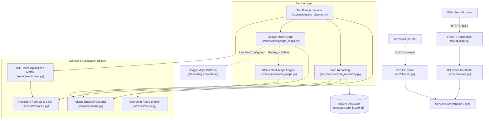

# Google Maps API Store Locator & Navigation Engine

[](https://github.com/breakingthebot/google-maps-store-locator-build140/actions/workflows/ci.yml)
[](LICENSE)
[](https://www.python.org/)
[](https://fastapi.tiangolo.com/)
[-brightgreen.svg)]()

Production-grade geospatial retail store locator, routing platform, and multi-stop trip planner. Powered by Google Maps Platform APIs (Geocoding, Directions, Places) and an offline-resilient simulation engine. Features Great-Circle Haversine proximity search, spatial bounding-box indexing, real-time operating hours evaluation ("Open Now", "Closing Soon"), Traveling Salesperson Problem (TSP) multi-stop route optimization, quantified mileage savings, customer rating aggregations, verified reviews, amenity filters, a Rich terminal CLI (`store-locator`), and an interactive single-page map interface.

---

## Architecture Overview



---

## Features

- **Geospatial Proximity Search**: Computes exact Haversine great-circle distances in kilometers and miles. Leverages bounding-box pre-filtering for scalable SQL spatial searches.
- **Multi-Stop Trip Planner & TSP Route Optimization**: Visit 2 to 12 stores in one trip. Uses spatial Traveling Salesperson algorithms (exact brute-force permutation for $N \le 8$, 2-opt heuristic for larger sets) to re-sequence waypoints and eliminate backtracking.
- **Quantified Travel Savings**: Calculates exact mileage, drive time, and percentage distance reductions gained over naive visiting order.
- **Real-Time Operating Hours & "Open Now" Engine**: Dynamically evaluates weekly 7-day schedules against the current local system clock. Displays "Open until X:XX PM", "Closing soon (Xm left)", and "Closed · Opens tomorrow at X:XX AM".
- **Turn-by-Turn Navigation & Polyline Routing**: Calculates turn-by-turn routing steps with distances, durations, and Google Maps encoded polylines across Driving, Walking, Bicycling, and Transit modes.
- **Zero-Key Offline Mock Simulation Engine**: Runs out of the box with zero external dependencies. Features deterministic geocoding for cities, postal codes, and landmarks, and simulated turn-by-turn routing when no Google Cloud billing key is provided.
- **Rich Command-Line Suite (`store-locator`)**: Complete terminal tool for proximity searching, multi-stop trip planning (`store-locator trip`), store profile inspection, routing, and database management.
- **Interactive Responsive Map Interface**: Standalone web UI with custom map pins color-coded by open/closed status, user radar location, search autocomplete, radius controls, filter chips, floating multi-stop trip drawer, and store details modal.
- **Automated Verification**: Comprehensive 56-test suite covering spatial geometry, operating hours boundary conditions, mock engines, TSP route optimization, REST endpoints, and CLI flows.

---

## Tech Stack

- **Language**: Python 3.12 (compatible with 3.10+)
- **Web Framework**: FastAPI, Uvicorn, Starlette
- **Data Validation & Schemas**: Pydantic v2, Pydantic Settings
- **HTTP Client**: HTTPX (async client with retry policies)
- **CLI & Formatting**: Click, Rich
- **Testing**: Pytest, Pytest-Asyncio
- **Frontend**: Vanilla JavaScript (ES6+), HTML5 Geolocation, Responsive CSS3, SVG Geospatial Map Canvas

---

## Quick Start & Setup

### 1. Clone & Setup Virtual Environment

```bash
git clone https://github.com/breakingthebot/google-maps-store-locator-build140.git
cd google-maps-store-locator-build140

# Create and activate virtual environment
python -m venv venv
# Windows:
venv\Scripts\activate
# macOS / Linux:
source venv/bin/activate

# Install dependencies and installable CLI
pip install -r requirements.txt
pip install -e .
```

### 2. Environment Configuration

Copy the example environment template:

```bash
cp .env.example .env
```

The app works **100% offline out-of-the-box** using `MockGoogleMapsService` with zero API keys required. To connect to live Google Maps Platform APIs:

```env
GOOGLE_MAPS_API_KEY=AIzaSyYourActualGoogleKeyHere
```

### 3. Run Automated Checks & Tests

```bash
pytest
```

---

## Running Locally

### Starting the Web UI & API Server

```bash
# Default port 8000 (or specify --port 8080 if port 8000 is in use)
store-locator serve --port 8080
```

Open your browser to: **http://localhost:8080**

### Using the CLI Suite

```bash
# View CLI version
store-locator --version

# Proximity search near San Francisco
store-locator search --address "San Francisco" --radius 20 --open-now

# View detailed store profile, weekly schedule, amenities, and reviews
store-locator get 1

# Calculate turn-by-turn route
store-locator directions --from-loc "760 Market St" --to-store 1 --mode driving

# Plan an optimized multi-stop trip visiting stores 1, 2, and 4
store-locator trip --origin "Market St" -s 1 -s 2 -s 4 --round-trip

# List registered stores
store-locator list --limit 10
```

---

## REST API Reference

| Method | Endpoint | Description |
|---|---|---|
| `GET` | `/api/health` | System health, database connection, and Maps provider status |
| `GET` | `/api/config` | Public frontend configuration and default coordinates |
| `GET` | `/api/geocode` | Geocode an address query or reverse geocode lat/lng |
| `GET` | `/api/stores/search` | Spatial proximity search with amenity & open-now filters |
| `GET` | `/api/stores/{id}` | Store details with full weekly schedule and customer reviews |
| `POST` | `/api/stores` | Register a new retail store location |
| `GET` | `/api/directions` | Single turn-by-turn navigation route, steps, and polyline |
| `POST` | `/api/trip/plan` | Plan multi-stop trip with TSP waypoint optimization and savings |
| `GET` | `/api/trip/preview` | Quick multi-stop preview endpoint |

---

## Data Handling & Privacy

- **Data Posture**: Store locator queries and geolocation requests are ephemeral and processed in-memory.
- **Zero PII Storage**: End-user search queries, GPS coordinates, and routing requests are never written to disk or database tables.
- **Redacted Logging**: All external HTTP requests to Google Maps Platform strictly mask and redact API keys (`***REDACTED***`).
- **Data Persistence**: Only retail store facility catalog records (store name, public street address, operating hours, amenities, public reviews) are persisted in `storage/store_locator.db`.

---

## License

This project is licensed under the MIT License — see the [LICENSE](LICENSE) file for details.
