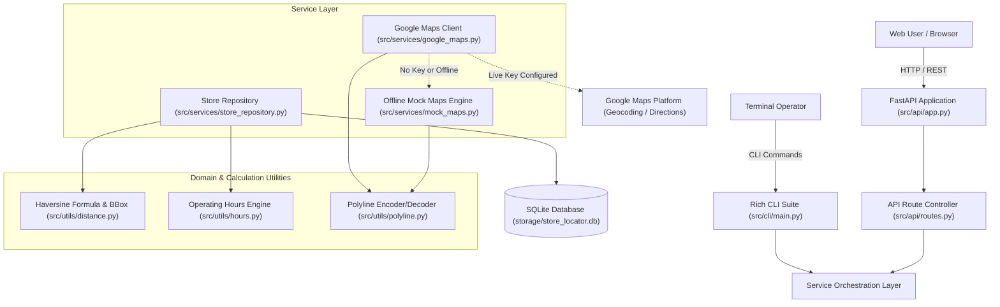

# Google Maps API Store Locator & Navigation Engine

[](https://github.com/breakingthebot/google-maps-store-locator-build140/actions/workflows/ci.yml)
[](LICENSE)
[](https://www.python.org/)
[](https://fastapi.tiangolo.com/)
[-brightgreen.svg)]()

Production-grade geospatial retail store locator and routing platform. Powered by Google Maps Platform APIs (Geocoding, Directions, Places) and an offline-resilient simulation engine. Features Great-Circle Haversine proximity search, spatial bounding-box indexing, real-time operating hours evaluation ("Open Now", "Closing Soon"), customer rating aggregations, verified reviews, amenity filters, a Rich terminal CLI (`store-locator`), and a responsive single-page map interface.

---

## Architecture Overview



---

## Features

- **Geospatial Proximity Search**: Computes exact Haversine great-circle distances in kilometers and miles. Leverages bounding-box pre-filtering for scalable SQL spatial searches.
- **Real-Time Operating Hours & "Open Now" Engine**: Dynamically evaluates weekly 7-day schedules against the current local time. Displays "Open until X:XX PM", "Closing soon (Xm left)", and "Closed · Opens tomorrow at X:XX AM".
- **Turn-by-Turn Navigation & Polyline Routing**: Calculates turn-by-turn routing steps with distances, durations, and Google Maps encoded polylines across Driving, Walking, Bicycling, and Transit modes.
- **Zero-Key Offline Mock Simulation Engine**: Runs out of the box with zero external dependencies. Features deterministic geocoding for cities, postal codes, and landmarks, and simulated turn-by-turn routing when no Google Cloud billing key is provided.
- **Rich Command-Line Suite (`store-locator`)**: Complete terminal tool for proximity searching, store inspection, routing, and database management.
- **Interactive Responsive Map Interface**: Standalone web UI with custom map pins color-coded by open/closed status, user radar location, search autocomplete, radius controls, filter chips, directions drawer, and store details modal.
- **Automated Verification**: Comprehensive test suite covering spatial geometry, operating hours boundary conditions, mock engines, REST endpoints, and CLI flows.

---

## Tech Stack

- **Language**: Python 3.12 (compatible with 3.10+)
- **Web Framework**: FastAPI, Uvicorn, Starlette
- **Data Validation & Schemas**: Pydantic v2, Pydantic Settings
- **HTTP Client**: HTTPX (async client with retry policies)
- **CLI & Formatting**: Click, Rich
- **Testing**: Pytest, Pytest-Asyncio
- **Frontend**: Vanilla JavaScript (ES6+), HTML5 Geolocation, Responsive CSS3, SVG Geospatial Map Canvas

---

## Quick Start & Setup

### 1. Clone & Setup Virtual Environment

```bash
git clone https://github.com/breakingthebot/google-maps-store-locator-build140.git
cd google-maps-store-locator-build140

# Create and activate virtual environment
python -m venv venv
# Windows:
venv\Scripts\activate
# macOS / Linux:
source venv/bin/activate

# Install dependencies and installable CLI
pip install -r requirements.txt
pip install -e .
```

### 2. Environment Configuration

Copy the example environment template:

```bash
cp .env.example .env
```

To connect to live Google Maps services, add your API key to `.env`:
```ini
GOOGLE_MAPS_API_KEY=your_google_maps_platform_api_key_here
```
*(If left empty or commented out, the offline mock engine automatically provides deterministic geocoding and routing).*

---

## Running Locally

### Launch the Web Application

```bash
store-locator serve --port 8000
# Or using uvicorn directly:
uvicorn src.api.app:app --host 0.0.0.0 --port 8000
```

Open your browser and navigate to:
- **Interactive Map UI**: `http://localhost:8000/`
- **Interactive OpenAPI Docs (Swagger)**: `http://localhost:8000/docs`
- **ReDoc Documentation**: `http://localhost:8000/redoc`

---

## CLI Usage Guide

The `store-locator` CLI suite provides command-line control over store proximity searches, navigation, and store directory inspection:

```bash
# Check CLI version
store-locator --version

# Search nearest stores by city or address
store-locator search --address "San Francisco" --radius 15

# Search with filters (Open Now only, minimum rating, specific amenity)
store-locator search --address "Market St, San Francisco" --open-now --min-rating 4.5 --amenity drive_thru

# Search by geographic coordinates
store-locator search --lat 37.7749 --lng -122.4194 --radius 25 --sort rating

# Get turn-by-turn navigation directions to store #1
store-locator directions --from-loc "760 Market St" --to-store 1 --mode driving

# Inspect a specific store's full weekly schedule, reviews, and amenities
store-locator get 1

# List all registered stores in the database
store-locator list --limit 10
```

---

## REST API Reference

| Method | Endpoint | Description |
| :--- | :--- | :--- |
| `GET` | `/api/health` | System health check and Maps provider status |
| `GET` | `/api/config` | Public frontend configuration and default center coordinates |
| `GET` | `/api/geocode` | Geocode address query or reverse-geocode lat/lng coordinates |
| `GET` | `/api/stores` | Proximity store search by address or lat/lng with filters |
| `GET` | `/api/stores/{id}` | Complete store profile with 7-day schedule and verified reviews |
| `POST` | `/api/stores` | Register a new retail store branch |
| `GET` | `/api/directions` | Calculate turn-by-turn directions, step instructions, and encoded polyline |

### Example Store Search Request:

```bash
curl -X GET "http://localhost:8000/api/stores?address=San+Francisco&radius_km=15&open_now=true"
```

### Example Directions Request:

```bash
curl -X GET "http://localhost:8000/api/directions?origin_lat=37.7749&origin_lng=-122.4194&destination_store_id=1&mode=driving"
```

---

## Running Tests

Execute the automated test suite with pytest:

```bash
# Run complete test suite
pytest -v --tb=short

# Run with test coverage
pytest --tb=short
```

---

## Data Handling & Privacy

- **Data Posture**: The application does not collect, track, or persist any end-user personal identifiers, payment details, or tracking cookies.
- **Location Data**: Search addresses and GPS coordinates provided by users are processed in memory solely to compute proximity distances and directions routes. Geocodes are never stored in user profiles or transmitted to third parties other than the Google Maps Platform (when live API keys are enabled).
- **Redaction & Secrets**: API tokens and secrets are loaded exclusively via environment variables and never logged in plain text. HTTP request logs automatically sanitize credentials.

---

## License

This project is licensed under the terms of the [MIT License](LICENSE).
